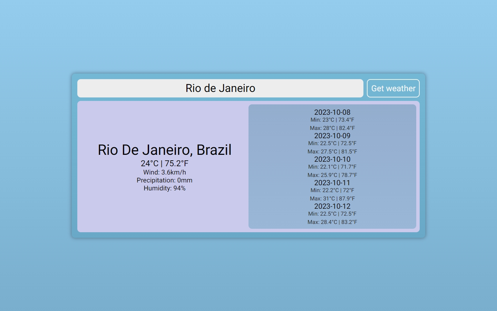

## Weather

### A weather application made with React, consuming the WeatherAPI free API.

## Installation

- Clone the repository, install the dependencies and follow the instructions on .env_dummy in order to execute the application.